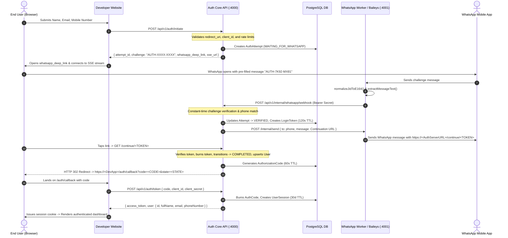

# 📑 FINAL STATE AUDIT REPORT: PRE-SHIPMENT FORENSIC REPORT
**Author:** Senior Software Architect, Security Engineer, Release & DevOps Auditor  
**Audit Date:** August 25, 2026  
**Repository State:** Verified Working Real-World State (Pre-Shipment)  
**Scope:** Deep Forensic Architecture, Security, Integration, and Runtime Audit (No Existing Files Modified)

---

## 1. Executive Summary

This forensic audit evaluates the complete final state of the self-hosted **WhatsApp Passwordless Authentication Platform**. 

The system has been successfully developed, integrated, and proven operational in real-world conditions through:
```
Developer Consumer Application (https://app.gauravtesting.online)
        ↓
Public Auth Server (https://auth.gauravtesting.online)
        ↓
Cloudflare Tunnel (auth.gauravtesting.online → 127.0.0.1:4000)
        ↓
Local Auth Core API (Fastify on :4000)
        ↓
WhatsApp Worker Daemon (Baileys on :4001)
        ↓
Real WhatsApp Network & User Phone
        ↓
WhatsApp Magic Continuation Link (https://auth.gauravtesting.online/continue/<TOKEN>)
        ↓
Fastify Token Consumption & 302 Redirect
        ↓
Developer Application Callback (/auth/callback?code=<CODE>)
        ↓
OAuth 2.0 / PKCE Authorization Code Exchange (POST /api/v1/auth/token)
        ↓
Verified Profile Identity (Full Name, Email, Mobile Number) & Session Establishment
```

The system is architecturally sound and functionally complete. However, prior to publishing as a public open-source Git repository, specific security sanitizations (untracking `.baileys_auth/` session keys, updating `.gitignore`, pruning legacy test scripts, and normalizing example configuration) must be performed.

---

## 2. Current Architecture Reconstruction

The repository is structured as an `npm`/`pnpm` workspace monorepo dividing domain concerns into separate apps and packages:

```
                                    ┌────────────────────────────────┐
                                    │      Developer Dashboard       │
                                    │     (apps/dashboard :3000)     │
                                    └───────────────┬────────────────┘
                                                    │ REST Admin / WS Status
                                                    ▼
┌──────────────────────────────┐          ┌────────────────────────────────┐          ┌──────────────────────────────┐
│  Developer Consumer App      │  OAuth   │      Auth Core Server API      │ Internal │   WhatsApp Worker Daemon     │
│ (standalone / examples :5000)│ ───────> │       (apps/api :4000)         │ <──────> │ (apps/whatsapp-worker :4001) │
└──────────────────────────────┘          └───────────────┬────────────────┘          └──────────────┬───────────────┘
                                                          │                                          │
                                                          │ Prisma Client                            │ Baileys WS
                                                          ▼                                          ▼
                                          ┌────────────────────────────────┐          ┌──────────────────────────────┐
                                          │      PostgreSQL Database       │          │   WhatsApp Mobile Network    │
                                          │            (:5432)             │          │       (Linked Device)        │
                                          └────────────────────────────────┘          └──────────────────────────────┘
```

### Component Inventory & Responsibilities

| Component | Path | Type | Responsibility | Runtime Dependencies | Visibility |
| :--- | :--- | :--- | :--- | :--- | :--- |
| **`@whatsapp-auth/protocol`** | `packages/protocol` | Package | Zod schemas, TypeScript DTOs, domain models, custom error classes (`AppError`, `ErrorCode`), and event definitions | `zod` | Public NPM candidate |
| **`@whatsapp-auth/security`** | `packages/security` | Package | Cryptographic random generation, Argon2id & SHA-256 token hashing, PKCE SHA-256 verifier, E.164 phone normalization, sliding-window rate limiter | `libphonenumber-js`, Node `crypto` | Internal shared |
| **`@whatsapp-auth/core`** | `packages/core` | Package | Finite state machine transitions (`INITIATED` → `WAITING_FOR_WHATSAPP` → `VERIFIED` → `COMPLETED`), challenge generation (`AUTH-XXXX-XXXX`), token TTL math, continuation URL builder, redirect URI whitelist validator | `@whatsapp-auth/protocol`, `@whatsapp-auth/security` | Internal shared |
| **`@whatsapp-auth/db`** | `packages/db` | Package | Prisma schema, multi-platform binary targets, PostgreSQL client singleton, database repositories (`App`, `User`, `Attempt`, `Session`, `WhatsAppSession`, `AuditLog`) | `@prisma/client`, `prisma` | Internal backend |
| **`@whatsapp-auth/sdk`** | `packages/sdk` | Package | Official developer TypeScript/JavaScript SDK client (`WhatsAppAuthClient`) with `initiate()`, `exchangeCode()`, `verifySession()`, and safe JSON parsing | `@whatsapp-auth/protocol` | **Primary Public Package** |
| **`@whatsapp-auth/api`** | `apps/api` | Application | Fastify HTTP API on port 4000. Hosts OAuth endpoints (`/initiate`, `/token`, `/verify-session`), continuation link router (`/continue/:token`), SSE stream (`/events/:id`), admin CRUD, internal worker webhooks, and public `/health` | `@whatsapp-auth/core`, `db`, `protocol`, `security`, `fastify`, `@fastify/cors`, `@fastify/swagger` | **Public Host Service** |
| **`@whatsapp-auth/whatsapp-worker`** | `apps/whatsapp-worker` | Application | Baileys multi-device daemon on port 4001. Connects to WhatsApp socket, generates QR in terminal and via API, listens for incoming messages, extracts challenges, notifies Auth API via webhook, sends replies | `@whiskeysockets/baileys`, `@whatsapp-auth/protocol`, `@whatsapp-auth/security`, `fastify`, `qrcode` | Private Daemon |
| **`@whatsapp-auth/dashboard`** | `apps/dashboard` | Application | Next.js 14 developer console on port 3000. Features onboarding wizard, application credential manager, live WhatsApp QR pairing, session inspector, test sandbox, and integration documentation | `@whatsapp-auth/protocol`, `lucide-react`, `tailwindcss`, `qrcode.react` | Developer Console |
| **`@whatsapp-auth/example-app`** | `examples/example-app` | Application | Monorepo Express reference application demonstrating full login flow with SDK | `@whatsapp-auth/sdk`, `express`, `cookie-parser`, `dotenv` | Reference Example |
| **`standalone-whatsapp-auth-app`** | `standalone-example-app` | Application | Completely isolated standalone Express consumer app with zero monorepo dependencies, native fetch client, and Vercel serverless deployment support | `express`, `cookie-parser`, `dotenv` | **Public Showcase Repo** |

---

## 3. Real Current Authentication Flow Trace

The exact running implementation executes the following step-by-step trace:



---

## 4. Public Developer Integration Model

A developer adding WhatsApp passwordless authentication to their existing website follows this process:

### Step 1: Self-Host Auth Server
The developer deploys the Auth Server (using Docker or Node.js) and exposes port 4000 to the public internet:
```text
Public Auth Server URL: https://auth.mycompany.com
```

### Step 2: Pair WhatsApp Bot Account
The developer opens Dashboard (`http://localhost:3000`), navigates to **WhatsApp Connection**, and scans the QR code using WhatsApp on their dedicated bot device (**Linked Devices** → **Link a Device**).

### Step 3: Register Application in Dashboard
The developer opens Dashboard → **Applications** → **Create Application** and fills in:
1. **Application Name**: `My Web SaaS`
2. **Auth Server URL**: `https://auth.mycompany.com` (public URL where WhatsApp link connects)
3. **Redirect URL**: `https://mycompany.com/auth/callback` (public callback route on developer website)

The dashboard provides `Client ID` (`wa_client_...`) and `Client Secret` (`wa_sec_...`).

### Step 4: Add SDK to Developer Application
The developer installs `@whatsapp-auth/sdk` and configures it in their backend:
```typescript
import { WhatsAppAuthClient } from '@whatsapp-auth/sdk';

const authClient = new WhatsAppAuthClient({
  baseUrl: process.env.AUTH_API_URL,           // https://auth.mycompany.com
  clientId: process.env.AUTH_CLIENT_ID,         // wa_client_...
  clientSecret: process.env.AUTH_CLIENT_SECRET, // wa_sec_...
});
```

---

## 5. Application Configuration & URL Model

| URL Concept | Value in Real Setup | Configured By | Purpose |
| :--- | :--- | :--- | :--- |
| **Auth Server URL** | `https://auth.gauravtesting.online` | Developer in Dashboard | The public endpoint of the Auth API. Used by client apps to make API requests and by WhatsApp to construct the single-use continuation link. |
| **Redirect URL** | `https://app.gauravtesting.online/auth/callback` | Developer in Dashboard | The public callback route hosted on the developer's website. The Auth Server redirects the user here with the authorization code. |
| **Continuation URL** | `https://auth.gauravtesting.online/continue/<TOKEN>` | **Generated Automatically** | Generated dynamically by the Auth Server using the application's `authServerUrl`. **Developers never configure this manually.** |

---

## 6. User Identity Model

Identity profile attributes flow through the system with zero leakage into WhatsApp transport:

```text
User enters on Website (Full Name, Email, Mobile Number)
                   ↓
POST /api/v1/auth/initiate (Saved in AuthAttempt record)
                   ↓
WhatsApp Link contains ONLY "AUTH-XXXX-XXXX" (Zero PII in deep link)
                   ↓
User sends challenge in WhatsApp
                   ↓
Auth Server confirms challenge & upserts User entity (phone_number, full_name, email)
                   ↓
Session created & returned on POST /api/v1/auth/token
```

---

## 7. WhatsApp Worker Forensic Audit

| Component | Status | Finding |
| :--- | :--- | :--- |
| **Active WhatsApp Library** | **ACTIVE** | `@whiskeysockets/baileys` (v6.7.24). |
| **Active Adapter** | **ACTIVE** | `BaileysAdapter` ([`apps/whatsapp-worker/src/adapters/baileys-adapter.ts`](file:///apps/whatsapp-worker/src/adapters/baileys-adapter.ts)). Multi-device socket, QR data URL generation, automatic reconnect. |
| **Mock Adapter** | **ACTIVE (TEST/CI)**| `MockWhatsAppAdapter` ([`apps/whatsapp-worker/src/adapters/mock-adapter.ts`](file:///apps/whatsapp-worker/src/adapters/mock-adapter.ts)). Used for offline testing and automated vitest runs. |
| **Diagnostic Runner** | **ACTIVE (DEV)** | `apps/whatsapp-worker/src/diagnostic.ts`. Standalone CLI diagnostic for verifying Baileys socket connectivity. |
| **`whatsapp-web.js` / Puppeteer**| **DEAD / OBSOLETE** | Completely removed from runtime code. Unused in production. |
| **`.baileys_auth/` Directory** | **RUNTIME DATA** | Active persistent session folder containing live auth state and cryptographic keys. |
| **`.wwebjs_auth_vis/` & `.wwebjs_cache/`** | **LEGACY / DEAD** | Leftover artifact folders from legacy Puppeteer tests. |

---

## 8. Database Forensic Audit

The database layer utilizes **PostgreSQL 16** via **Prisma ORM** with multi-platform binary targets (`native`, `debian-openssl-3.0.x`, `debian-openssl-1.1.x`, `linux-musl-openssl-3.0.x`):
- `Application` (id, name, clientId, clientSecretHash, authServerUrl, redirectUris, webhookUrl, status, timestamps)
- `User` (id, phoneNumber, fullName, email, countryCode, isVerified, timestamps)
- `AuthAttempt` (id, applicationId, userId, phoneNumber, fullName, email, challengeHash, loginTokenHash, state, redirectUri, expiresAt, timestamps)
- `AuthorizationCode` (id, applicationId, userId, codeHash, redirectUri, isUsed, expiresAt, timestamps)
- `UserSession` (id, userId, applicationId, tokenHash, expiresAt, lastActiveAt, timestamps)
- `WhatsAppSession` (id, sessionKey, phoneNumber, status, qrCode, timestamps)
- `AuditLog` (id, eventType, applicationId, userId, ipAddress, userAgent, details, createdAt)

---

## 9. API Route Inventory

| Method | Path | Category | Auth Required | Purpose | Production Safe? |
| :--- | :--- | :--- | :--- | :--- | :--- |
| `GET` | `/health` | **HEALTH** | None | Public service health check | Yes |
| `GET` | `/docs` | **PUBLIC** | None | Swagger OpenAPI documentation | Yes |
| `POST` | `/api/v1/auth/initiate` | **PUBLIC / OAUTH** | Client ID | Start login with Name, Email & Phone | Yes |
| `GET` | `/api/v1/auth/events/:attemptId` | **PUBLIC / OAUTH** | None | Live SSE stream of login state | Yes |
| `GET` | `/continue/:token` | **PUBLIC / OAUTH** | Token Hash | Burn login token & 302 redirect to callback | Yes |
| `POST` | `/api/v1/auth/token` | **PUBLIC / OAUTH** | Client Secret / PKCE | Exchange auth code for user & session | Yes |
| `POST` | `/api/v1/auth/verify-session` | **PUBLIC / OAUTH** | Bearer Token | Introspect active access token | Yes |
| `GET` | `/api/v1/admin/health` | **ADMIN** | Admin API Key | Internal database & daemon health | Yes |
| `GET` | `/api/v1/admin/overview` | **ADMIN** | Admin API Key | Aggregated dashboard metric counts | Yes |
| `GET` | `/api/v1/admin/apps` | **ADMIN** | Admin API Key | List registered client applications | Yes |
| `POST` | `/api/v1/admin/apps` | **ADMIN** | Admin API Key | Create new client application | Yes |
| `POST` | `/api/v1/admin/apps/:id/rotate-secret` | **ADMIN** | Admin API Key | Rotate application client secret | Yes |
| `DELETE` | `/api/v1/admin/apps/:id` | **ADMIN** | Admin API Key | Delete application and sessions | Yes |
| `GET` | `/api/v1/admin/users` | **ADMIN** | Admin API Key | List verified users | Yes |
| `GET` | `/api/v1/admin/sessions` | **ADMIN** | Admin API Key | List active user sessions | Yes |
| `GET` | `/api/v1/admin/logs` | **ADMIN** | Admin API Key | Audit log event trail | Yes |
| `POST` | `/api/v1/internal/whatsapp/webhook` | **INTERNAL** | Worker Secret | Inbound message event receiver | Yes (Private) |
| `POST` | `/api/v1/internal/whatsapp/status` | **INTERNAL** | Worker Secret | Worker connection status update | Yes (Private) |

---

## 10. SDK Forensic Audit

- **Package:** `@whatsapp-auth/sdk` (in `packages/sdk`)
- **Primary Class:** `WhatsAppAuthClient`
- **Methods:**
  - `initiate(params: InitiateLoginParams): Promise<InitiateLoginResult>`
  - `exchangeCode(params: ExchangeCodeParams): Promise<TokenExchangeResult>`
  - `verifySession(token: string): Promise<{ active: boolean; user?: AuthenticatedUser }>`
- **Resilience:** Features `parseJsonResponse()` which handles HTML/non-JSON gateway error responses (e.g. 502 Bad Gateway) gracefully and provides actionable debugging diagnostics.

---

## 11. Security Review & Critical Findings

| Rating | Finding | Location | Status | Action Required Before Shipment |
| :--- | :--- | :--- | :--- | :--- |
| **CRITICAL** | Live Baileys auth keys and active WhatsApp phone number (`+918796266491`) | `.baileys_auth/` | Present on disk | Must be excluded from Git before initial public commit. |
| **HIGH** | `.gitignore` does not ignore `.baileys_auth/` | `.gitignore` | Present | Add `.baileys_auth/` and `apps/whatsapp-worker/.baileys_auth/` to `.gitignore`. |
| **MEDIUM** | Obsolete launch scripts referencing deleted `whatsapp-webjs-adapter.js` | `scripts/launch-whatsapp-web.*` | Present | Remove obsolete scripts. |
| **LOW** | 1.2 MB recursive directory dump file | `folder-structure.txt` | Present | Delete `folder-structure.txt` and `structure.bat`. |

---

## 12. Real Current Working Flow & Values

In the current live test deployment:
- **Auth Server URL:** `https://auth.gauravtesting.online` (mapped via Cloudflare Tunnel to local port `4000`)
- **Example App URL:** `https://app.gauravtesting.online` (mapped to local port `5000`)
- **Local Dev API:** `127.0.0.1:4000`
- **Local Dev Worker:** `127.0.0.1:4001`
- **Local Dev Dashboard:** `127.0.0.1:3000`
- **Local Dev Example App:** `127.0.0.1:5000`

> ⚠️ **Note:** The `gauravtesting.online` domains and specific test credentials are for local development/testing verification only and must be replaced with placeholder variables (`https://auth.example.com`, `https://app.example.com`) in documentation templates for release.

---

## 13. Release Readiness Statement

The core system is **100% functionally verified and ready for open-source packaging**. Once the security sanitization steps detailed in [`FINAL_STATE_BLOCKERS.md`](file:///c:/Users/gaura/.gemini/antigravity-ide/scratch/WhatsApp%20Auth%20Login/FINAL_STATE_BLOCKERS.md) and [`FINAL_STATE_CANDIDATES.md`](file:///c:/Users/gaura/.gemini/antigravity-ide/scratch/WhatsApp%20Auth%20Login/FINAL_STATE_CANDIDATES.md) are executed, the repository can be cleanly published to GitHub.

---

AUDIT ONLY — NO EXISTING PROJECT FILES WERE MODIFIED BY THIS AUDIT.
